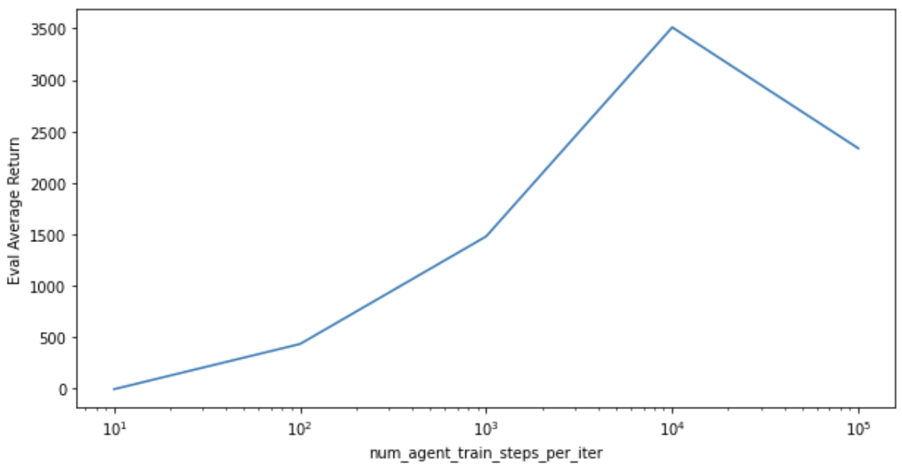
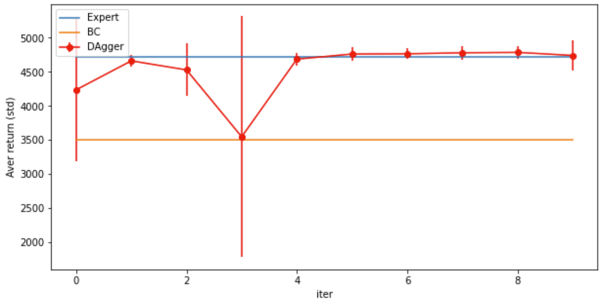

# Домашняя работа  Практическая часть 1
### Мелкумов Михаил

## (2.1) Behavioral Cloning
###  Задание 1
Результаты использования Behavioral Cloning для сред (Параметры есть в файле hw1.ipynb):

Ant-v2:
```
Eval_AverageReturn : 4459.7724609375
Eval_StdReturn : 712.1804809570312
-----
Initial_DataCollection_AverageReturn : 4713.6533203125
```

Walker2d:
```
Eval_AverageReturn : 2730.468505859375
Eval_StdReturn : 1293.3822021484375
------
Initial_DataCollection_AverageReturn : 5566.845703125
```

###  Задание 2


На графике изображена зависимость результатов от num_agent_train_steps


## (2.2) Dagger


График обучения DAgger’а