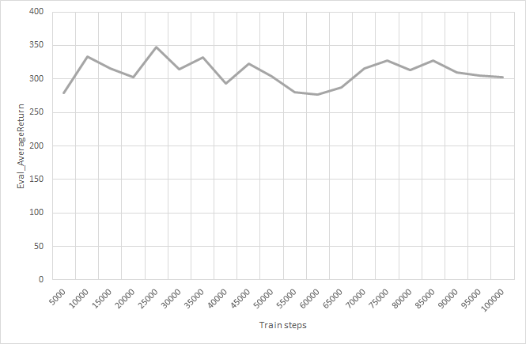
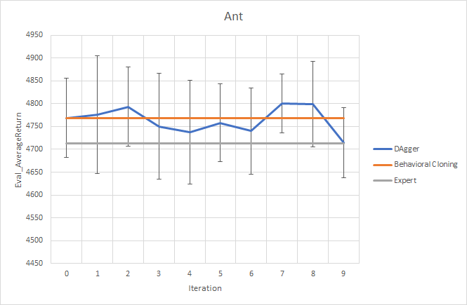
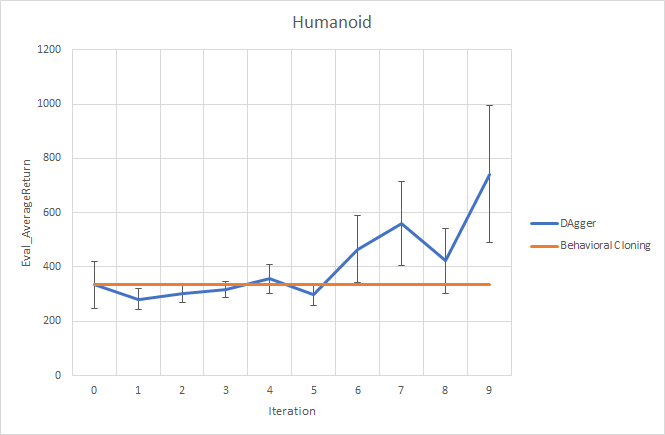

## Теоретическая часть

## Практическая часть
Агент обучен на 10000 шагах. Имеет MLP policy, состоящий из 2 скрытых слоёв и 64 нейронов в каждом слое. Eval_batch_size изменён на 10000, а learning_rate на 4e-3. Остальные параметры без изменений.

### Задание BC.1
Исследуемые среды - Ant и Humanoid.

| Environment | Behavioral Cloning | Expert |
|-|:-:|:-:|:-:|
| Ant | 4768,92 ± 86,93 | 4713,65 ± 12,2 |
| Humanoid | 333,66 ± 87,42 | 10344,52 ± 20,98 |

### Задание BC.2
Возможно, если увеличить число шагов обучения, то удастся улучшить результаты обучения для Humanoid.

Из графика видим, что наилучшее значение удаётся получить при числе шагов равным 25000. Но это всё равно далеко от результата эксперта.

### Задание DA.1
Гиперпараметры те же, что и в <b>задании BC.1</b>, за исключением числа итераций -- оно равно 10.
Для Humanoid на графике не проведена горизонтальная линия с результатом эксперта (Eval_AverageReturn = 10344), так как этот результат значительно превосходит результаты работы алгоритмов.  

