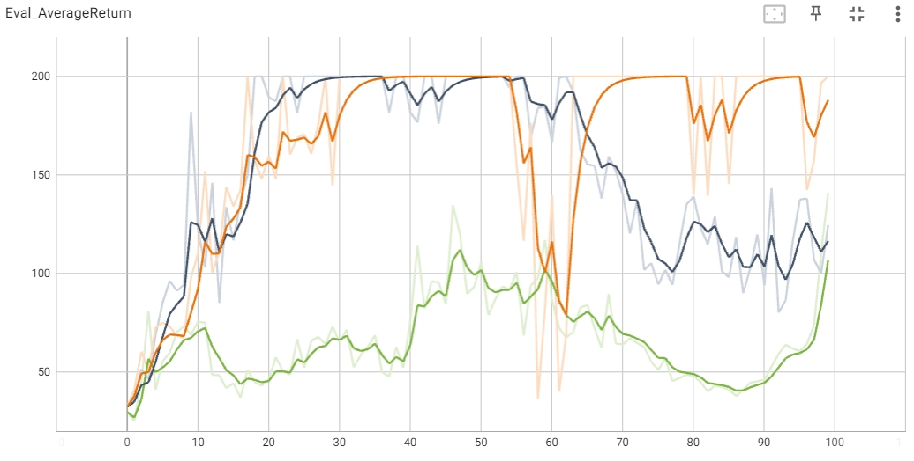
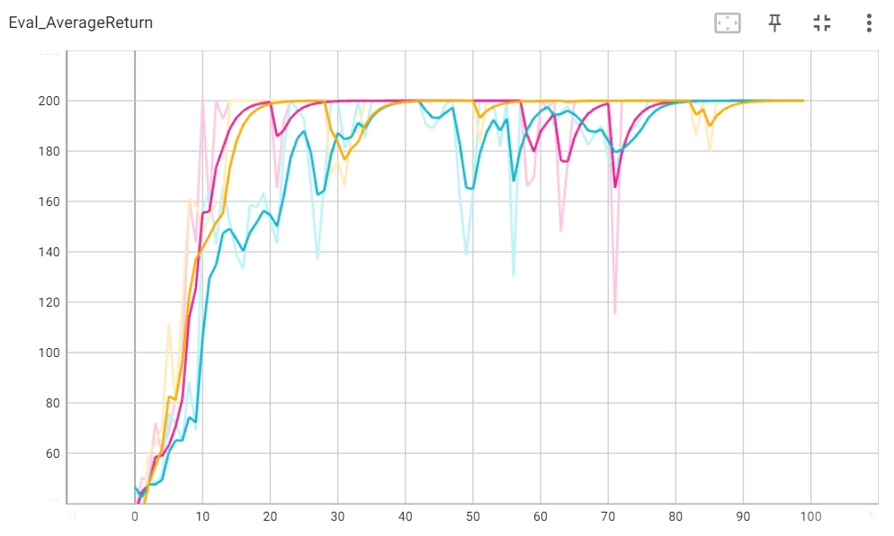
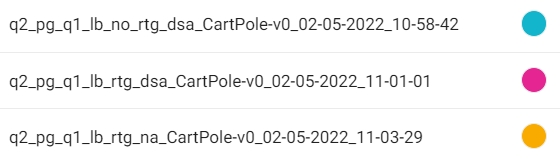
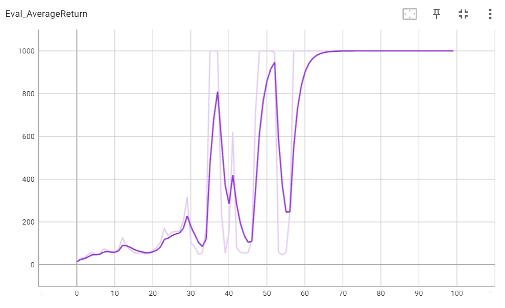
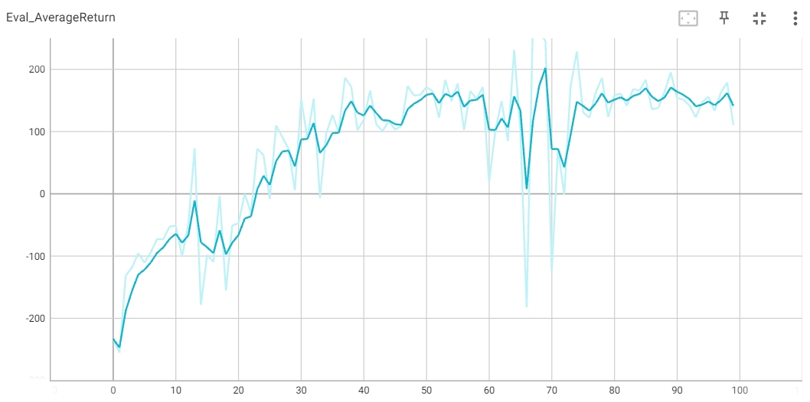
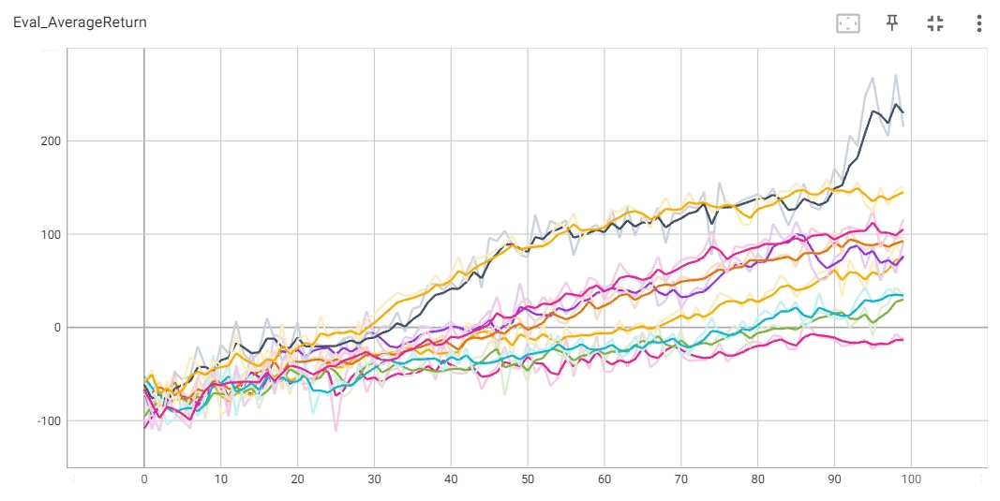
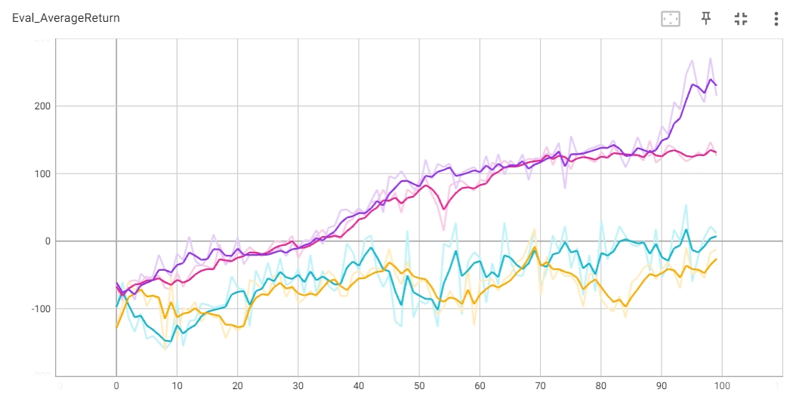
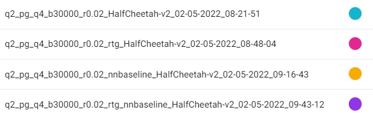
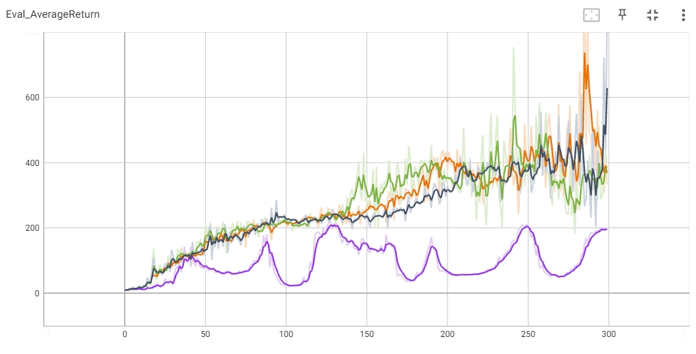
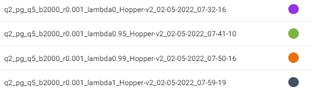

# Отчёт по выполнению практической части

## Эксперимент 1: CartPole
1. Small batch size
   
   
   
2. Large batch size
   
   
   

- Какой из вариантов оценки отдачи имеет лучшие результаты без нормализации
значения преимущества?

**Ответ**: Наилучший результат при параметрах: ```reward_to_go = True```, ```standardize_advantages = False``` и batch_size = 5000 (малиновая линия на втором графике).

- Помогает ли нормализация значения преимущества?

**Ответ**: Да, при большом размере пакета.

- Как влияет размер пакета на качество обучения?

**Ответ**: Увеличение размера пакета положительно влияет на скорость обучения.

## Эксперимент 2: InvertedPendulum
Наилучшие полученные значения: batch_size = 1000, learning rate = 0.02



Команда запуска:

```
!python scripts/run_hw2.py \
    --env_name InvertedPendulum-v2 \
    --ep_len 1000 --discount 0.9 -n 100 -l 2 -s 64 \
    -b 1000 -lr 0.02 -rtg \
    --exp_name q2_b1000_r0.02
```

## Эксперимент 3: LunarLander



## Эксперимент 4: HalfCheetah




(* допустила опечатку в названиях логов: последние три эксперимента относятся к batch size = 50000)

Увеличение коэффициента скорости обучения значительно ускоряет сходимость обучения, увеличение размера также увеличивает награду.

Наилучшие полученные значения: batch_size = 30000, learning rate = 0.02




## Эксперимент 5: Hopper




λ близкий к единице ускоряет сходимость к решению. 
