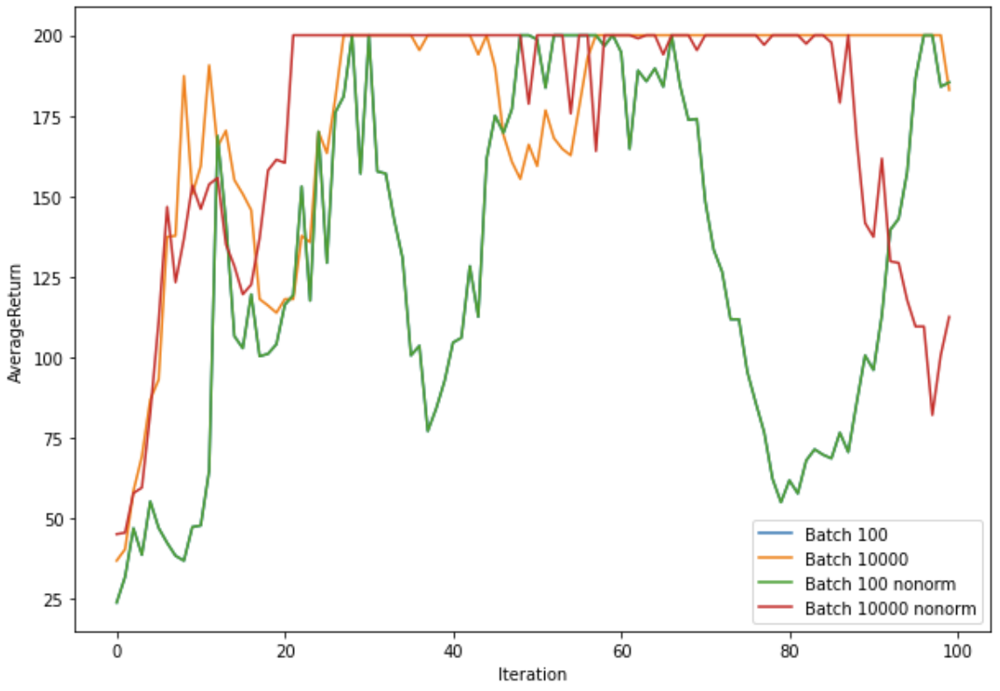
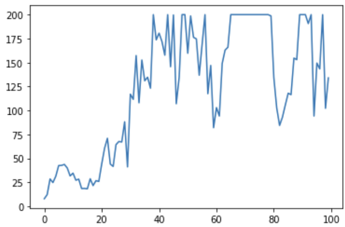

# Домашняя работа  Практическая часть 2
### Мелкумов Михаил

## (2.3) Запуск простых экспериментов
###  CartPol

С возрастанием размера батча, возрастает скорость сходимости к оптимуму.
Нормализаци позволяет уменьшить дисперсию при схождении к оптимуму

## (2.2) InvertedPendulum

Оптимальными параметрами оказались lr = 1e-2 batch_size=200
