## 2. Практическая часть
#### Эксперимент 1: CartPole
Кривые обучения средней отдачи на каждой итерации для экспериментов с маленьким размером пакета:
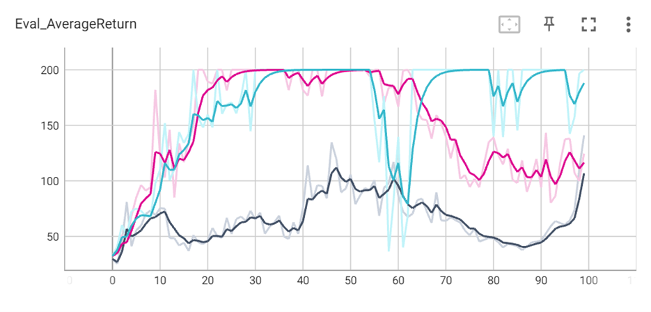
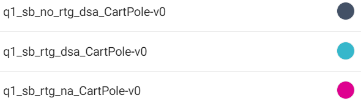

Кривые обучения средней отдачи на каждой итерации для экспериментов с большим размером пакета:
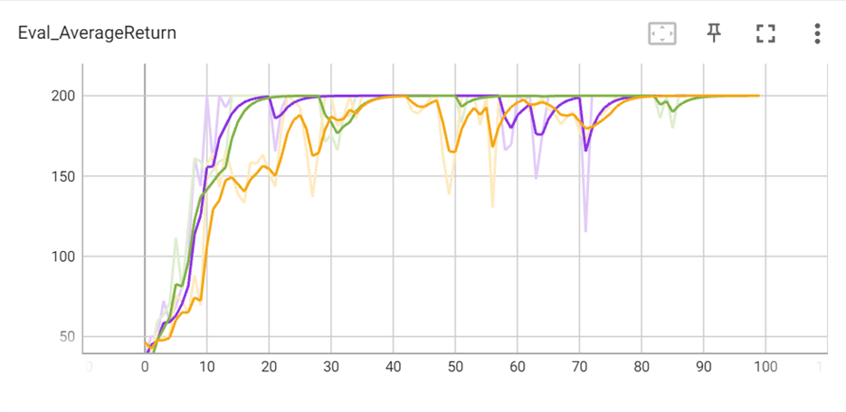
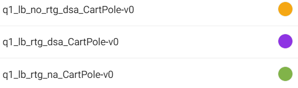

Ответы на вопросы:
1) Какой из вариантов оценки отдачи имеет лучшие результаты без нормализации значения преимущества?
- Лучшим результатом является q1_lb_rtg_dsa (-b 5000 -rtg -dsa)

2) Помогает ли нормализация значения преимущества?
- При маленьком размере пакета нормализация не даёт ощутимого выигрыша, а при большом – видно, что решение получается с меньшей дисперсией

3) Как влияет размер пакета на качество обучения?
- Чем больше размер пакета, тем больше скорость сходимости решения
```
!python /content/cds_rl_2022/rl_hw/hw2/hw2/scripts/run_hw2.py \
    --env_name CartPole-v0 -n 100 -b 1000 \
    -dsa --exp_name q1_sb_no_rtg_dsa

!python /content/cds_rl_2022/rl_hw/hw2/hw2/scripts/run_hw2.py \
    --env_name CartPole-v0 -n 100 -b 1000 \
    -rtg -dsa --exp_name q1_sb_rtg_dsa

!python /content/cds_rl_2022/rl_hw/hw2/hw2/scripts/run_hw2.py \
    --env_name CartPole-v0 -n 100 -b 1000 \
    -rtg --exp_name q1_sb_rtg_na

!python /content/cds_rl_2022/rl_hw/hw2/hw2/scripts/run_hw2.py \
    --env_name CartPole-v0 -n 100 -b 5000 \
    -dsa --exp_name q1_lb_no_rtg_dsa

!python /content/cds_rl_2022/rl_hw/hw2/hw2/scripts/run_hw2.py \
    --env_name CartPole-v0 -n 100 -b 5000 \
    -rtg -dsa --exp_name q1_lb_rtg_dsa

!python /content/cds_rl_2022/rl_hw/hw2/hw2/scripts/run_hw2.py \
    --env_name CartPole-v0 -n 100 -b 5000 \
    -rtg --exp_name q1_lb_rtg_na
```
#### Эксперимент 2: InvertedPendulum
Подбираем параметры таким образом, чтобы размер пакета был минимальным, а скорость обучения была бы максимальной:
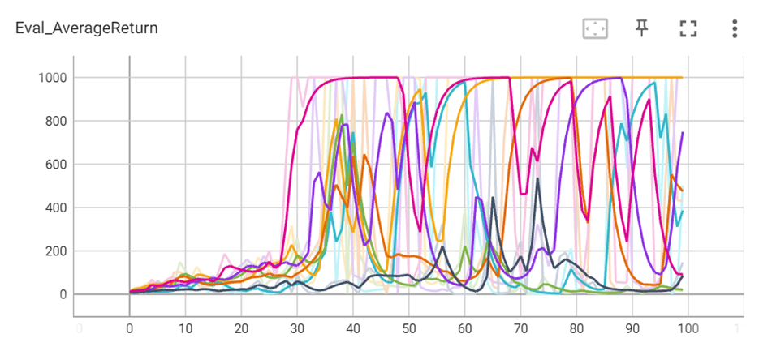
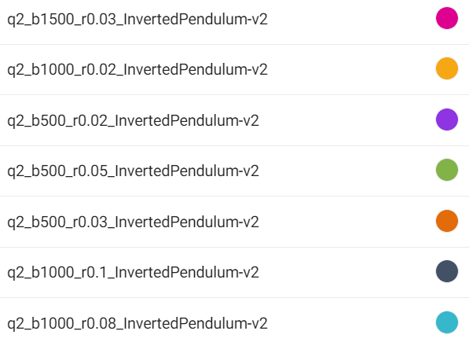

Лучший результат получился при b = 1000, lr = 0.08:
```
!python /content/cds_rl_2022/rl_hw/hw2/hw2/scripts/run_hw2.py \
    --env_name InvertedPendulum-v2 \
    --ep_len 1000 --discount 0.9 -n 100 -l 2 -s 64 \
    -b 1000 -lr 0.08 -rtg \
    --exp_name q2_b1000_r0.08
```
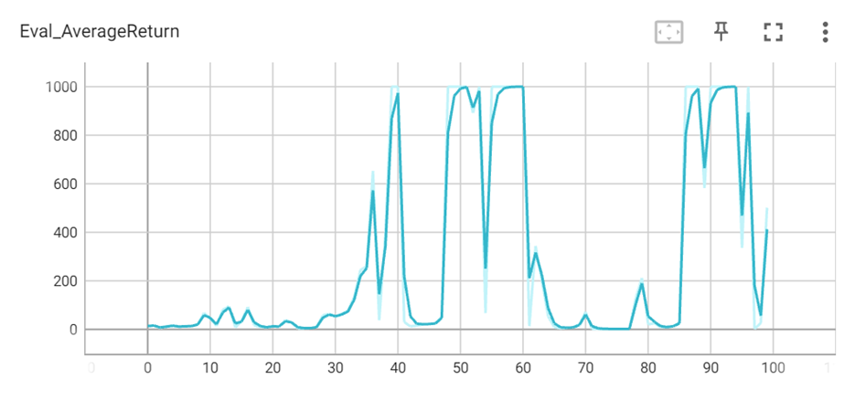

#### Эксперимент 3: LunarLander
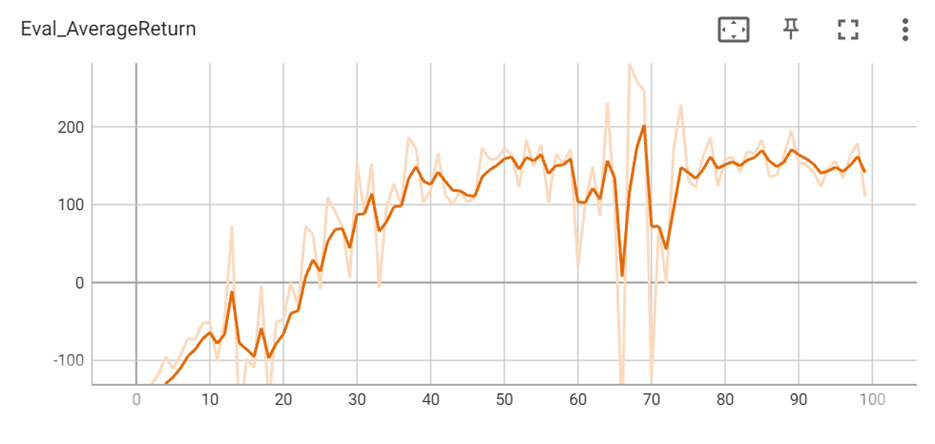

#### Эксперимент 4: HalfCheetah
Подбор наилучших параметров:
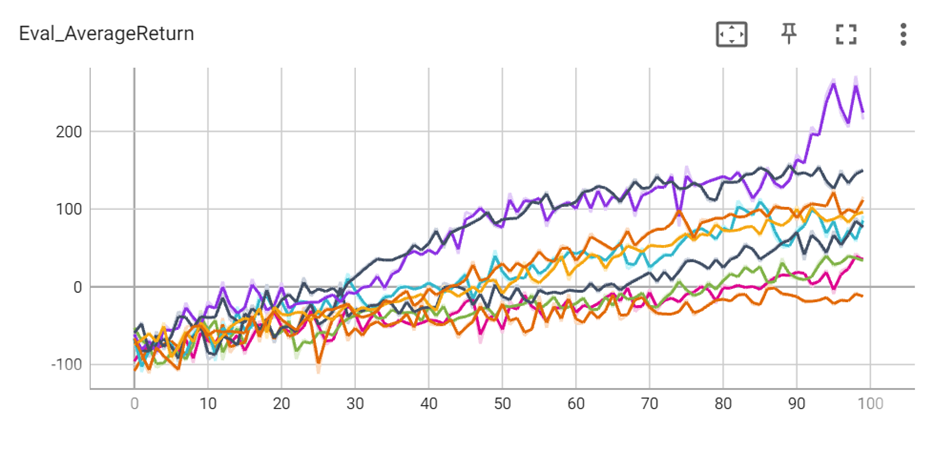
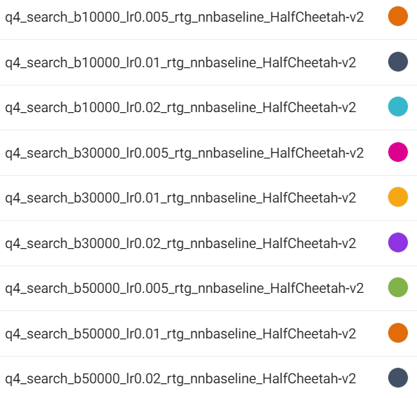
Чем больше learning_rate, тем больше награда, получаемая в итоге

Серия экспериментов с парамтерами b=30000, lr=0.02:
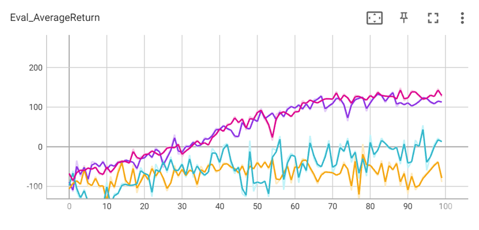
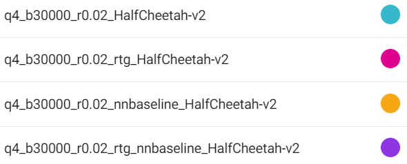

#### Эксперимент 5: Hopper
Обучение агента с разными параметрами λ ∈ [0, 0.95, 0.99, 1]:
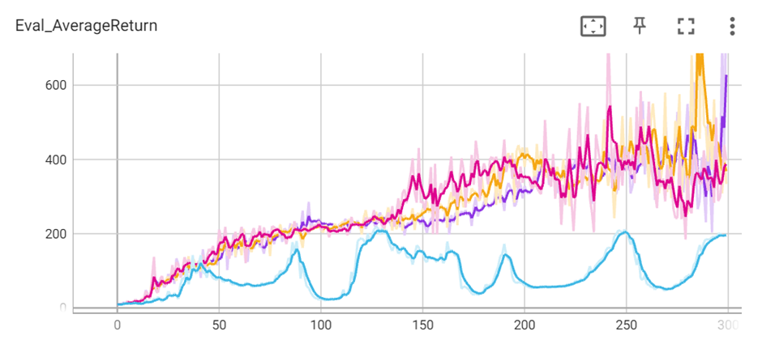
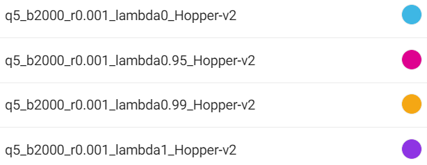
Чем больше λ, тем больше награда, получаемая в итоге