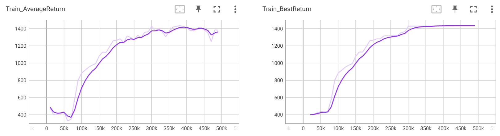
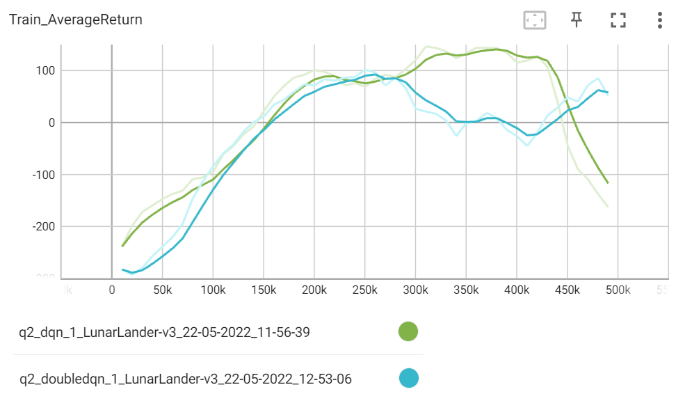
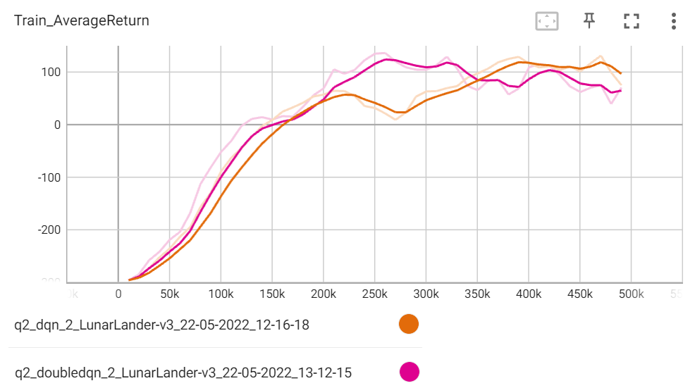
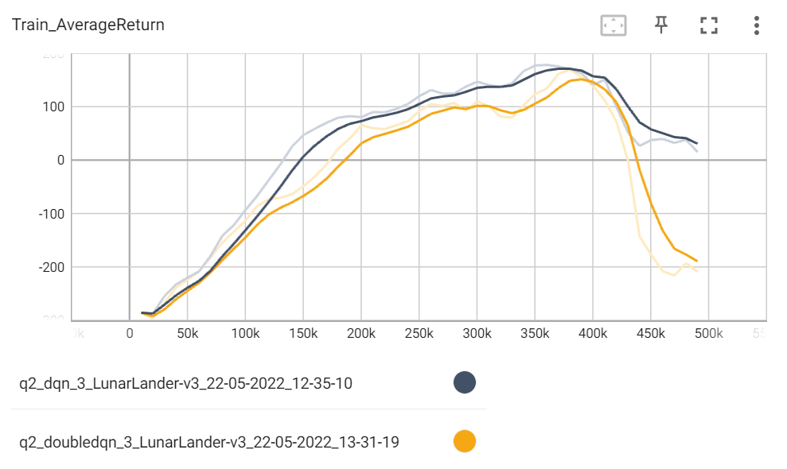
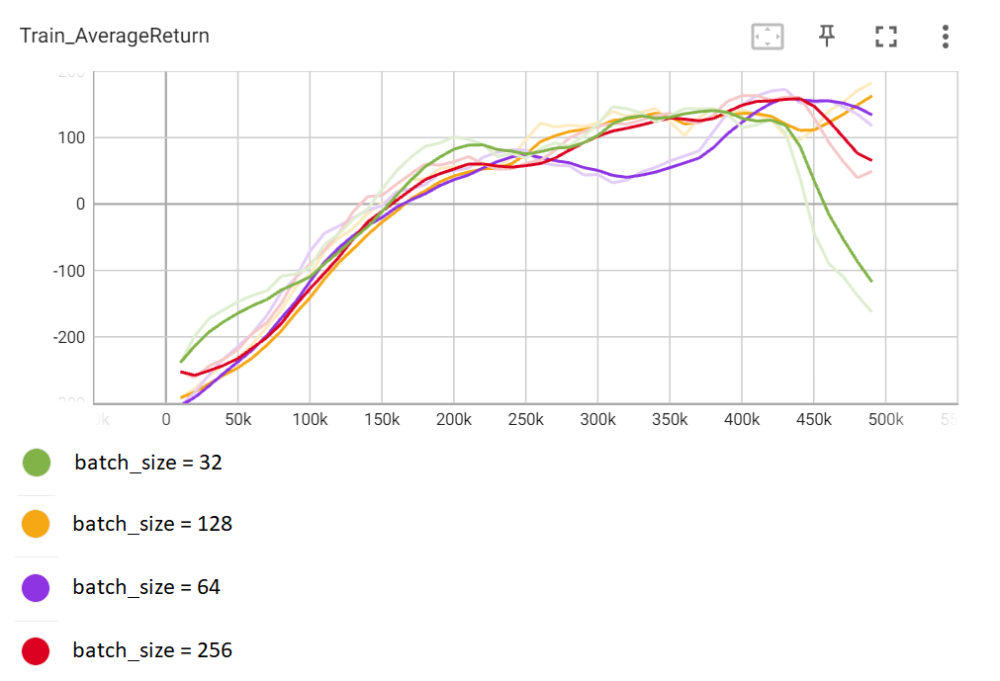
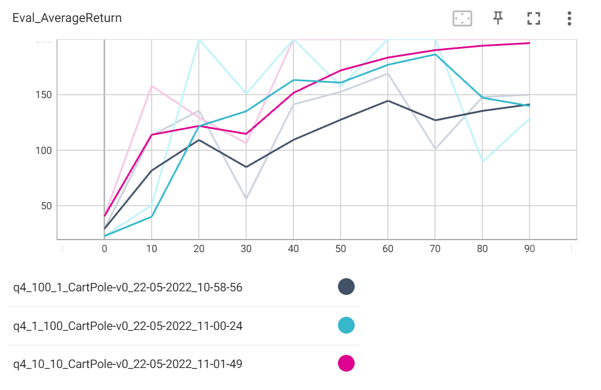
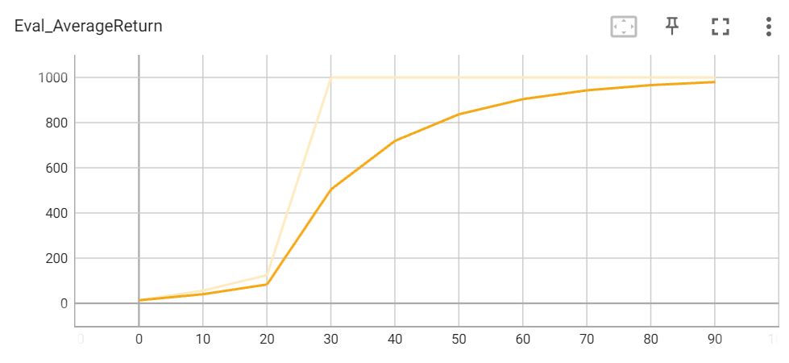
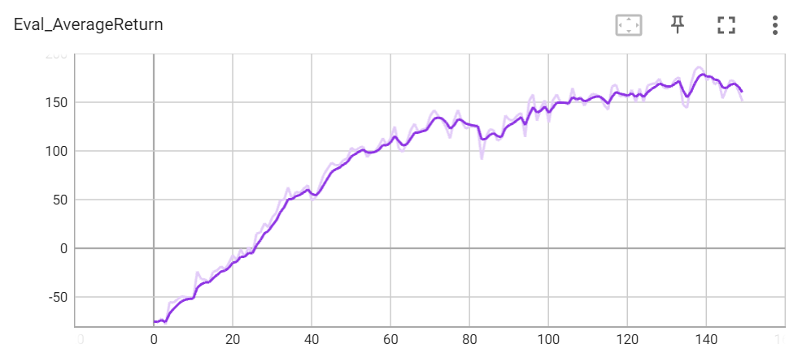

## 2. Практическая часть
#### Эксперимент 1: Base Q-learning
Кривые обучения реализации на Ms. Pac-Man:

```
!python /content/cds_rl_2022/rl_hw/hw3/hw3/scripts/run_hw3_dqn.py --env_name MsPacman-v0 --exp_name q1
```

Для проведения этого эксперимента был изменён гиперпараметр, отвечающий за число временных шагов:
```
num_timesteps = 500000
```

#### Эксперимент 2: DQN vs DDQN
Ниже приведены графики со сравнением средних результатов алгоритмов DQN и DDQN в Lunar Lander.
При seed = 1:

```
!python /content/cds_rl_2022/rl_hw/hw3/hw3/scripts/run_hw3_dqn.py --env_name LunarLander-v3 --exp_name q2_dqn_1 --seed 1
!python /content/cds_rl_2022/rl_hw/hw3/hw3/scripts/run_hw3_dqn.py --env_name LunarLander-v3 --exp_name q2_doubledqn_1 --double_q --seed 1
```

При seed = 2:

```
!python /content/cds_rl_2022/rl_hw/hw3/hw3/scripts/run_hw3_dqn.py --env_name LunarLander-v3 --exp_name q2_dqn_2 --seed 2
!python /content/cds_rl_2022/rl_hw/hw3/hw3/scripts/run_hw3_dqn.py --env_name LunarLander-v3 --exp_name q2_doubledqn_2 --double_q --seed 2
```

При seed = 3:

```
!python /content/cds_rl_2022/rl_hw/hw3/hw3/scripts/run_hw3_dqn.py --env_name LunarLander-v3 --exp_name q2_dqn_3 --seed 3
!python /content/cds_rl_2022/rl_hw/hw3/hw3/scripts/run_hw3_dqn.py --env_name LunarLander-v3 --exp_name q2_doubledqn_3 --double_q --seed 3
```

#### Эксперимент 3: DQN hyperparameters
Эксперименты проводились в среде Lunar Lander, а в качестве гиперпараметра для исследования был выбран - batch_size.
С помощью этого параметра удалось незначительно изменить скорость выполнения алгоритма, хотя предполагалось, что разница будет существенной.
Ниже приведены графики при различном размере батча (32, 64, 128, 256):

```
!python /content/cds_rl_2022/rl_hw/hw3/hw3/scripts/run_hw3_dqn.py --env_name LunarLander-v3 --exp_name q3_hparam
```

Лучший результат был достигнут при batch_size = 64 и batch_size = 128.

#### Эксперимент 4: Sanity check with CartPole
Подбор наилучших параметров:

```
!python /content/cds_rl_2022/rl_hw/hw3/hw3/scripts/run_hw3_actor_critic.py --env_name CartPole-v0 -n 100 -b 1000 --exp_name q4_100_1 -ntu 100 -ngsptu 1
!python /content/cds_rl_2022/rl_hw/hw3/hw3/scripts/run_hw3_actor_critic.py --env_name CartPole-v0 -n 100 -b 1000 --exp_name q4_1_100 -ntu 1 -ngsptu 100
!python /content/cds_rl_2022/rl_hw/hw3/hw3/scripts/run_hw3_actor_critic.py --env_name CartPole-v0 -n 100 -b 1000 --exp_name q4_10_10 -ntu 10 -ngsptu 10
```

Из приведённых графиков видно, что наилучший результат получается при num_target_updates = 10, num_grad_steps_per_target_update = 10.

#### Эксперимент 5: Run actor-critic with more difficult tasks
График результатов для среды InvertedPendulum:

```
!python /content/cds_rl_2022/rl_hw/hw3/hw3/scripts/run_hw3_actor_critic.py --env_name InvertedPendulum-v2 --ep_len 1000 --discount 0.95 -n 100 -l 2 -s 64 -b 5000 -lr 0.01 --exp_name q5_10_10 -ntu 10 -ngsptu 10
```

Видно, что после 100 итераций отдача находится на уровне 1000.

График результатов для среды HalfCheetah.:

```
!python /content/cds_rl_2022/rl_hw/hw3/hw3/scripts/run_hw3_actor_critic.py --env_name HalfCheetah-v2 --ep_len 150 --discount 0.90 --scalar_log_freq 1 -n 150 -l 2 -s 32 -b 30000 -eb 1500 -lr 0.02 --exp_name q5_10_10 -ntu 10 -ngsptu 10
```

Видно, что после 150 итераций отдача находится на уровне 150.