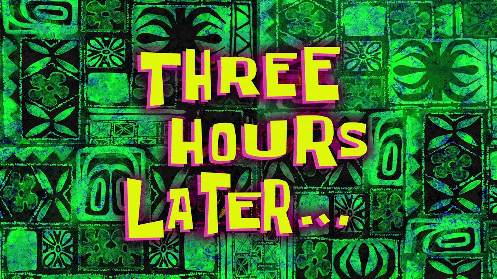
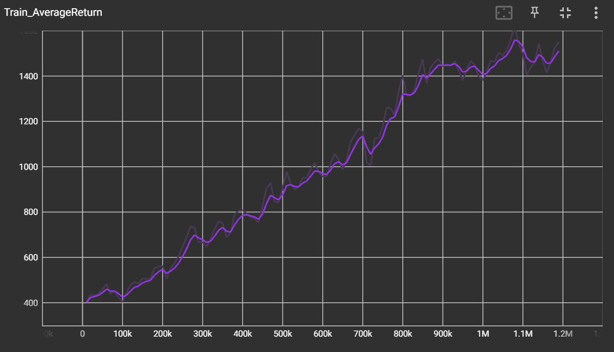
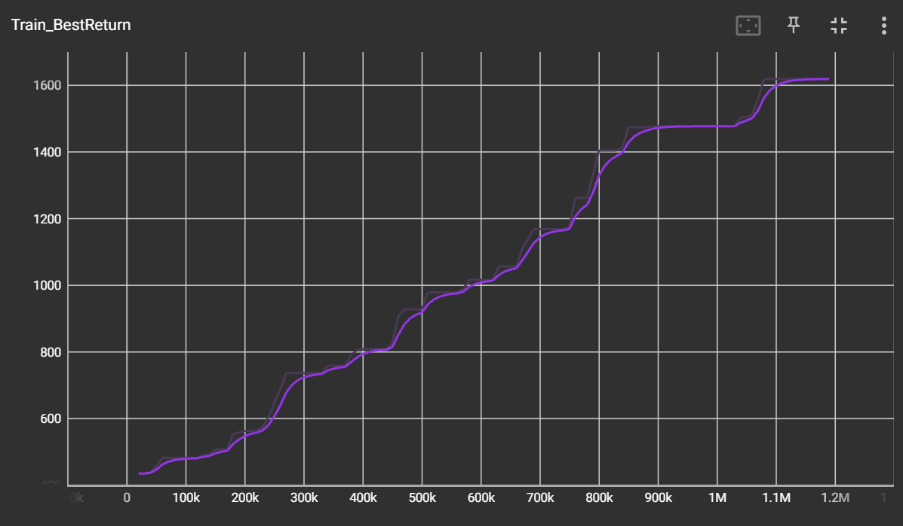
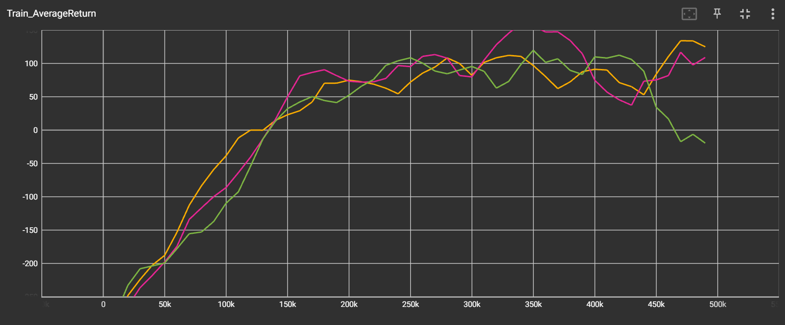
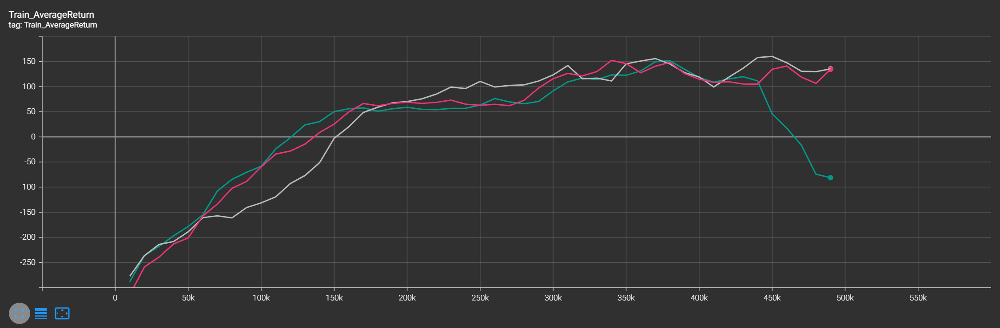
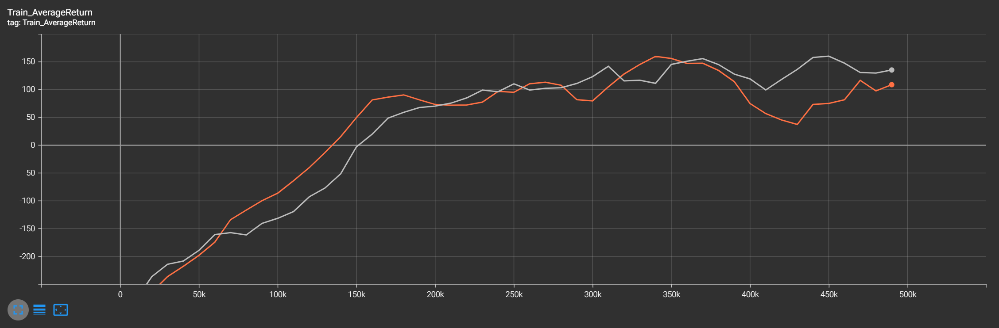
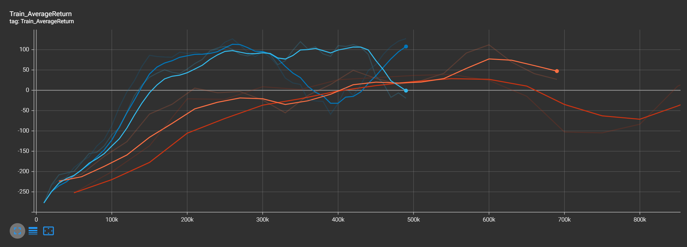
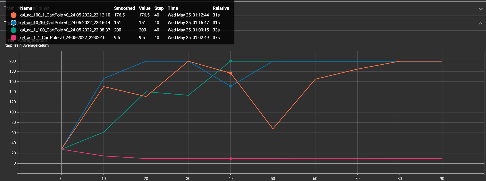
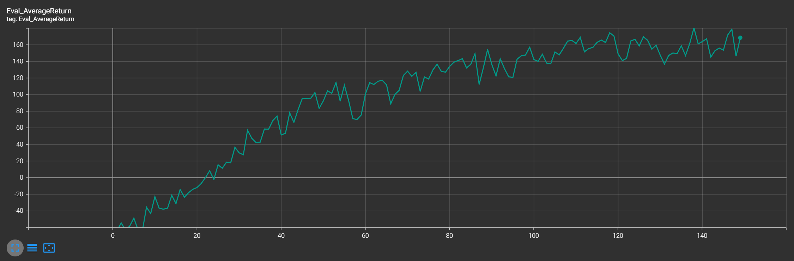
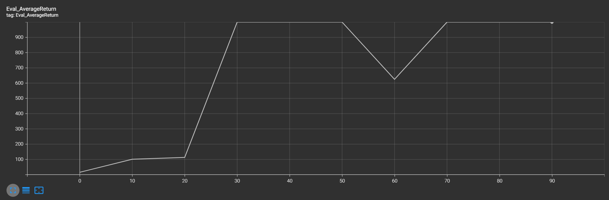

# Домашняя работа  Практическая часть 2
### Мелкумов Михаил

## (2.1) Тестирование Q-обучения


###  Качество базовой версии Q-обучения (Ms. Pac-Man) 





###  Качество двойного Q-обучения (LunarLander)

3 исследования DQN:





3 исследования DDQN:




Сравнение лучших dqn(оранжевый) и ddqn(серый):




###  Эксперименты с гиперпараметрами

Я решил попробовать поменять количество слоёв в сети



И не нашел особой разницы в результатах(

## (2.2) Тестирование метода актор-критик

### Проверка правильности реализации на CartPole



Наилучший результат показали параметры:
```
num_target_updates: 10
num_grad_steps_per_target_update: 10
```

Протестируем на других средах с такими же параметрами

### Проверка метода актор-критик на более сложных средах

HalfCheet:



InvertedPendulum:

