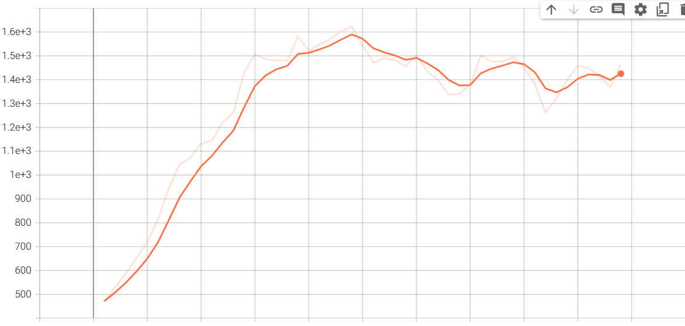
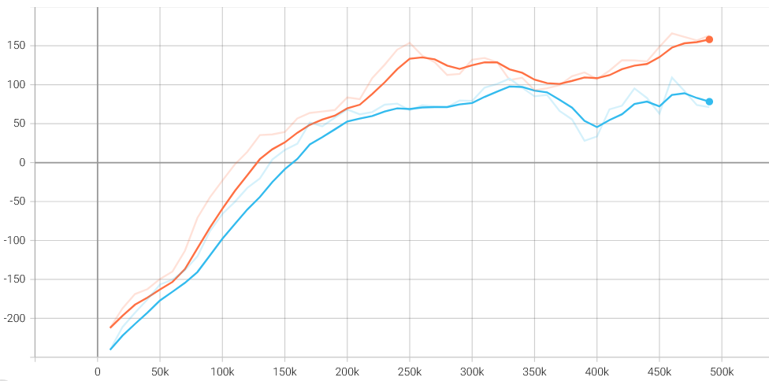
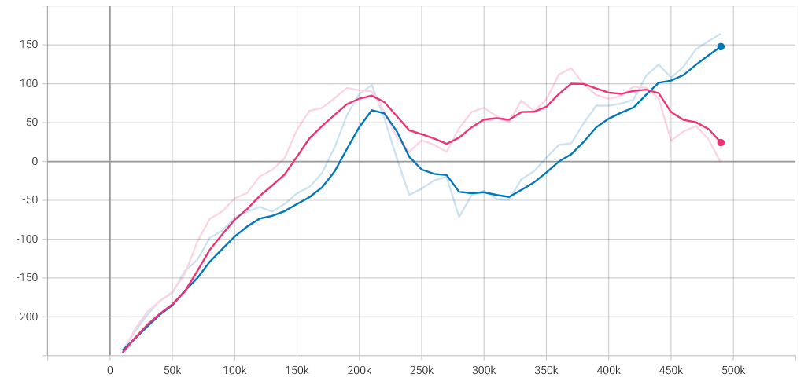
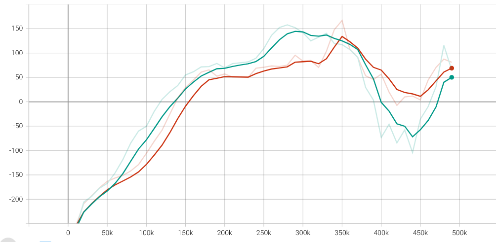
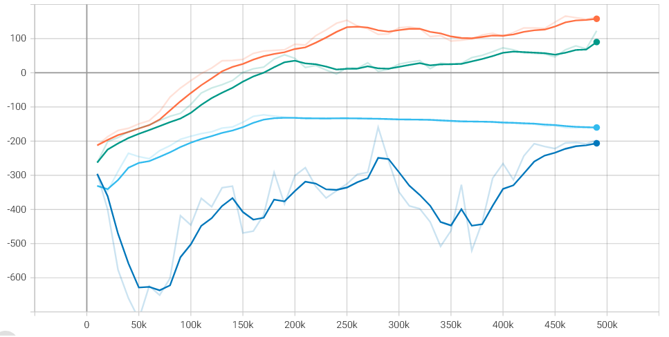
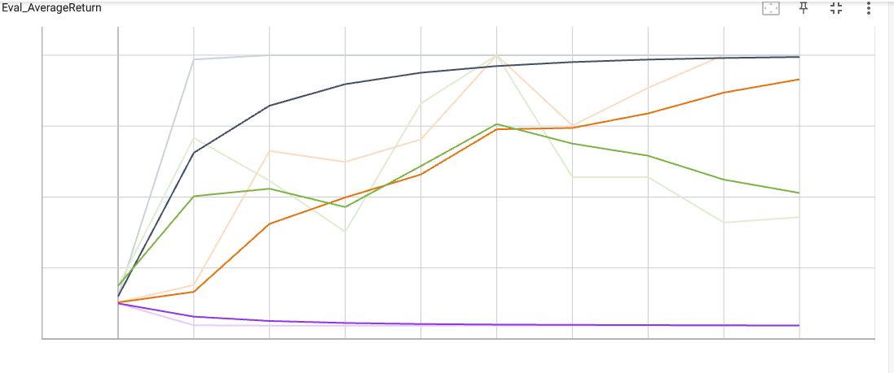
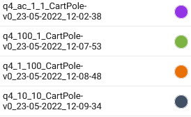
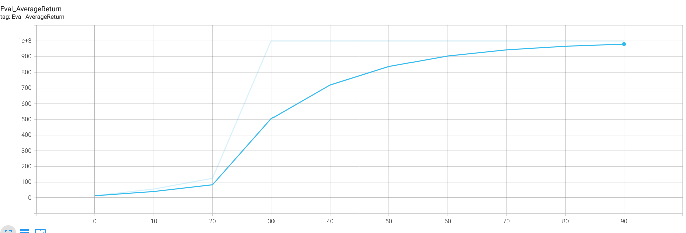
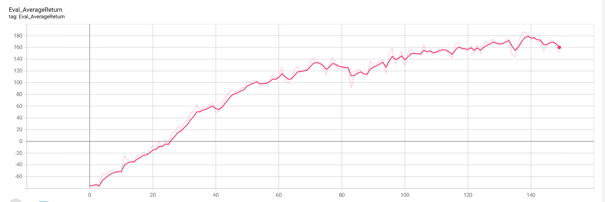

# Отчёт по выполнению практической части
## Задание 1. Качество базовой версии Q-обучения (DQN)
Кривая обучения на *Ms. Pac-man*

Обучение не удалось запустить с помощью GPU из-за ошибки CUDA, которую я не смогла исправить. Поэтому обучение производилось на CPU, а число ```num_timesteps``` было сокращено до 500000 (фактически, шагов получилось чуть меньше - обучение прервалось).
## Задание 2. Качество двойного Q-обучения (DDQN)
Три запуска с различными инициализациями генератора случайных чисел (seed = 1,2,3)
```
!python hw3/scripts/run_hw3_dqn.py --env_name LunarLander-v3 --exp_name q2_dqn_1 --seed 1
!python hw3/scripts/run_hw3_dqn.py --env_name LunarLander-v3 --exp_name q2_doubledqn_1 --double_q --seed 1
```

Средний результат для DQN (оранжевая кривая) выше, чем для DDQN (голубая кривая).
```
!python hw3/scripts/run_hw3_dqn.py --env_name LunarLander-v3 --exp_name q2_dqn_2 --seed 2
!python hw3/scripts/run_hw3_dqn.py --env_name LunarLander-v3 --exp_name q2_doubledqn_2 --double_q --seed 2
```

Синяя кривая - DQN, малиновая - DDQN. Результат сначала лучше для DDQN, но со временем виден рост для DQN.
```
!python hw3/scripts/run_hw3_dqn.py --env_name LunarLander-v3 --exp_name q2_dqn_3 --seed 3
!python hw3/scripts/run_hw3_dqn.py --env_name LunarLander-v3 --exp_name q2_doubledqn_3 --double_q --seed 3
```

Оранжевая кривая - DQN, Зеленая - DDQN.
## Задание 3. Эксперименты с гиперпараметрами
В качестве гиперпараметра был выбран learning rate, меняющийся в диапазоне [0.001, 0.01, 0.95, 1].

Улучшить производительность не удалось. Худший результат получился при наименьшем learning rate, с ростом скорости обучения увеличивается точность, лучший результат - learning rate = 1.
## Задание 4. Проверка правильности реализации на CartPole



Агент с наилучшим набором параметров: ```number_of_target_updates = 10, number_of_gradient_updates = 10```. 
## Задание 5. Проверка метода актор-критик на более сложных средах
*InvertedPendulum*

*HalfCheetah*

Результаты примерно совпадают с результатами градиента стратегии из второго домашнего задания.
