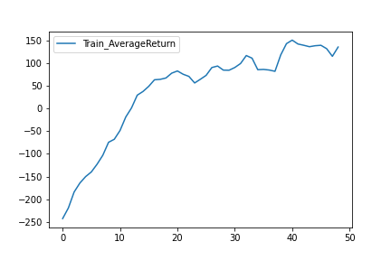
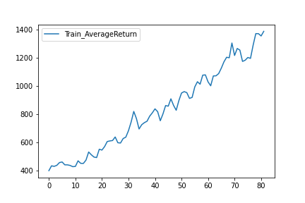
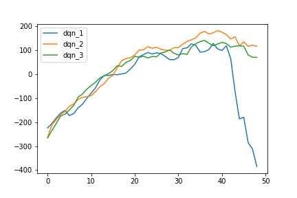
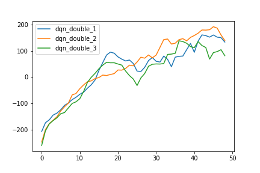
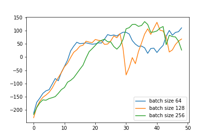
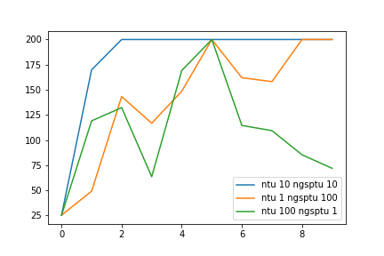

Теоретическая часть
===================

Практическая часть
===================
__1.__ Качество базовой версии Q-обучения (DQN) 

Тест в среде Lunar Lander:

Качество достигает результа 150.

Тест в среде Pacman:

**Примечание**: После нескольких крашей колаба так и не получилось все миллион итераций прогнать. Лучший результат около 1400 при 820к итерациях. Делалось параллельно с другой тетрадке.

__2.__ Качество двойного Q-обучения (DDQN)

Из графиков видно, что DDQN работает стабильнее и лучше DQN, который может с некоторой итерации улетать вниз.

__3.__ Эксперименты с гиперпараметрами

Изменял параметр batch_size. Он принимал значения 64, 128, 256. Примечательно, что с увеличением этого параметра линия графика ведет себя все более нестабильно, делая большие рывки вниз или вверх.  

__4.__ Актор-критик. CartPole

Лучший результат был достигнут при параметрах ntu = 10 и ngsptu = 10. При таких параметрах алгоритм сходится к решению быстрее остальных.

__5.__ Тестирование в сложных средах.

Не получилось добиться хороших результатов.