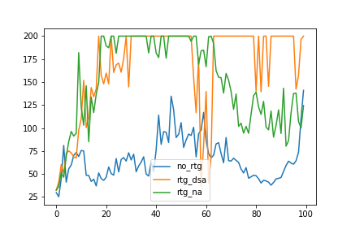
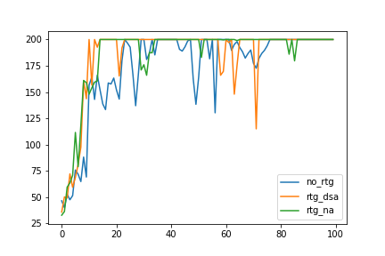
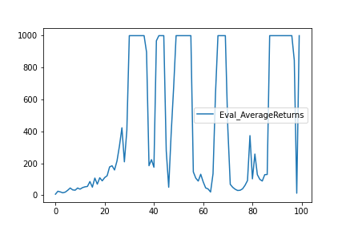
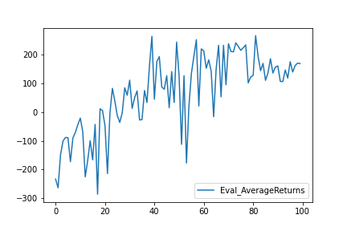
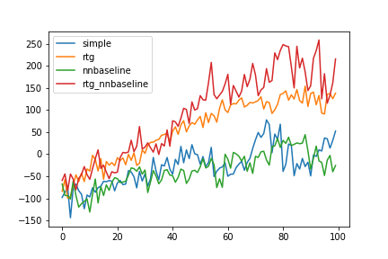
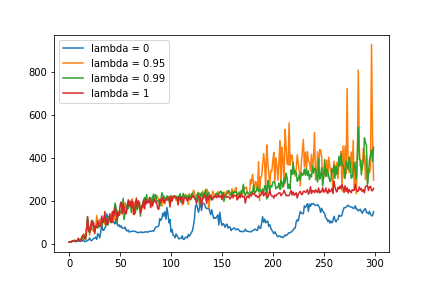

Теоретическая часть
===================


Практическая часть
===================
__1.__ CartPole 





Какой из вариантов оценки отдачи имеет лучшие результаты без нормализации значения преимущества?

rtg оценка дает лучший результат без нормализации значения преимущества.

Помогает ли нормализация значения преимущества?

При малом размере пакета нормализация не помогает, но при большом размере пакета сходимость становится намного быстрее и стабильнее.

Как влияет размер пакета на качество обучения?

Размер пакета положительно влияет на качество обучения.

__2.__ InvertedPendulum.

Лучшие параметры следующие: batch_size = 800, learning_rate = 0.02



Код:
```
!python3 /content/cds_rl_2022/rl_hw/hw2/hw2/scripts/run_hw2.py \
    --env_name InvertedPendulum-v2 \
    --ep_len 1000 --discount 0.9 -n 100 -l 2 -s 64 \
    -b 800 -lr 0.02 -rtg \
    --exp_name q2_b800_r0.02
```

__3.__ LunarLander



Примечание: средняя отдача на последней итерации равна 169.

__4.__ HalfCheetah.

Лучшие параметры следующие: batch_size = 50000, learning_rate = 0.02



__5.__ Hopper.

Увеличение lambda вплоть до 0.99 улучшало качество обучения, но, когда параметр равен 1, качество резко падает.

