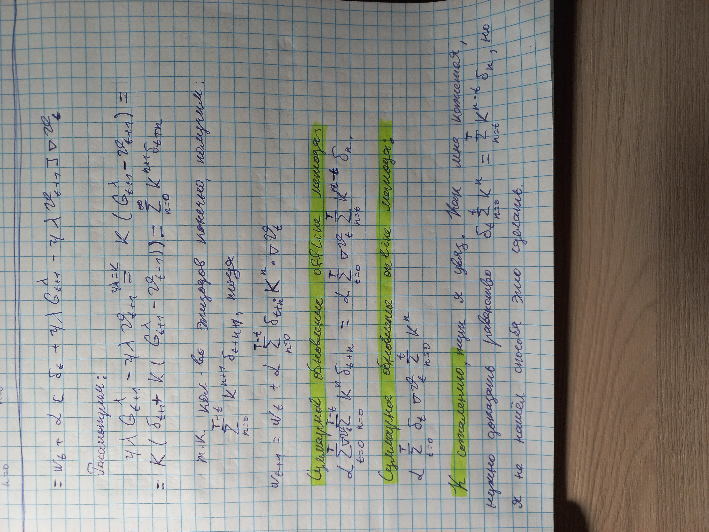
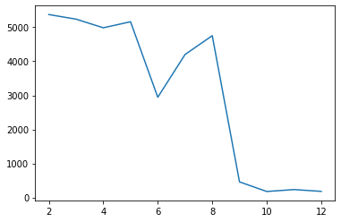
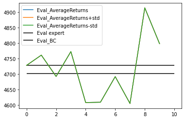
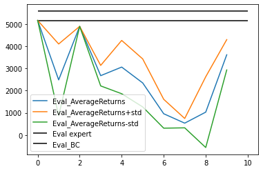

Теоретическая часть
===================




Практическая часть
===================
__ВС1.__ Были изменены параметры n_layers и size. Теперь они имеют значения 5 и 62 соответственно. 

Использовались среды Ant и Walker2d.

Ant AverageReturn эксперт: 4701.4565
Ant AverageReturn BC: 4728.1748

Walker2d Eval_AverageReturn эксперт: 5576.08
Walker2d AverageReturn BC: 5161.0303

__BC2.__ Среда Walker2d. Был зафиксирован параметр n_layers - количество скрытых слоев может сильно сказаться на качестве.



Параметр был опробован в диапазоне от 2 до 12.

Код:
```
for n_layers in range(2, 13):
    args.n_layers = n_layers
    trainer = BC_Trainer(args)
    trainer.run_training_loop()

Eval_AverageReturns_it = []
f = "/content/cds_rl_2022/hw1/data/q1_test_bc_Walker_Walker2d-v2_13-03-2022_21-14-09/"
for dir in os.listdir(f):
    for summary in summary_iterator(f+dir):
        for v in summary.summary.value:
            if v.tag == "Eval_AverageReturn":
                Eval_AverageReturns_it.append(v.simple_value)
plt.plot([i for i in range(2, 2+len(Eval_AverageReturns_it))], Eval_AverageReturns_it)
```

__DA1.__ Во всех средах был один и тот же набор гиперпараметров:

```
ep_len: 1500
num_agent_train_steps_per_iter: 5000
n_iter = 10

batch_size: 1000
eval_batch_size: 1000
train_batch_size: 100
max_replay_buffer_size: 1000000

n_layers: 5
size: 62
learning_rate: 5e-3
```

Ant:

Примечательно то, что стандартное отклонение в этой среде нулевое. Не нашел этому объяснений, учитывая, что в других средах оно ненулевое.



Код:
```
f = open("/content/cds_rl_2022/rl_hw/hw1/cds_rl/expert_data/expert_data_Ant-v2.pkl", "rb")
data_new = pickle.load(f)
eval_expert = sum(data_new[0]['reward'])

Eval_AverageReturns, Eval_Std_returns = [], []
for summary in summary_iterator("/content/cds_rl_2022/hw1/run_logs/q2_test_bc_Ant_dagger_Ant-v2_13-03-2022_21-44-20/events.out.tfevents.1647207862.f0e62d5ca1a7"):
    for v in summary.summary.value:
        if v.tag == "Eval_AverageReturn":
            Eval_AverageReturns.append(v.simple_value)
        elif v.tag == 'Eval_StdReturn':
            Eval_Std_returns.append(v.simple_value)
Eval_AverageReturns = np.array(Eval_AverageReturns)
Eval_Std_returns = np.array(Eval_Std_returns)

Eval_AverageReturns_beh, Eval_Std_returns_beh = [], []
for summary in summary_iterator("/content/cds_rl_2022/hw1/run_logs/q1_test_bc_Ant_beh_clonning_Ant-v2_13-03-2022_21-43-24/events.out.tfevents.1647207805.f0e62d5ca1a7"):
    for v in summary.summary.value:
        if v.tag == "Eval_AverageReturn":
            Eval_AverageReturns_beh.append(v.simple_value)
        elif v.tag == 'Eval_StdReturn':
            Eval_Std_returns_beh.append(v.simple_value)

plt.plot(Eval_AverageReturns, label = "Eval_AverageReturns")
plt.plot(Eval_AverageReturns + Eval_Std_returns, label = "Eval_AverageReturns+std")
plt.plot(Eval_AverageReturns - Eval_Std_returns, label = "Eval_AverageReturns-std")
plt.hlines(eval_expert, 0,   len(Eval_AverageReturns), label = "Eval expert")
plt.hlines(Eval_AverageReturns_beh[0], 0,   len(Eval_AverageReturns), label = "Eval_BC")
plt.legend()
```

Walker2d:



Код:
```
f = open("/content/cds_rl_2022/rl_hw/hw1/cds_rl/expert_data/expert_data_Walker2d-v2.pkl", "rb")
data_new = pickle.load(f)
eval_expert = sum(data_new[0]['reward'])

Eval_AverageReturns, Eval_Std_returns = [], []
for summary in summary_iterator("/content/cds_rl_2022/hw1/run_logs/q2_test_bc_Walker_dagger_Walker2d-v2_13-03-2022_21-35-33/events.out.tfevents.1647207357.f0e62d5ca1a7"):
    for v in summary.summary.value:
        if v.tag == "Eval_AverageReturn":
            Eval_AverageReturns.append(v.simple_value)
        elif v.tag == 'Eval_StdReturn':
            Eval_Std_returns.append(v.simple_value)
Eval_AverageReturns = np.array(Eval_AverageReturns)
Eval_Std_returns = np.array(Eval_Std_returns)

Eval_AverageReturns_beh, Eval_Std_returns_beh = [], []
for summary in summary_iterator("/content/cds_rl_2022/hw1/run_logs/q1_test_bc_Walker_beh_clonning_Walker2d-v2_13-03-2022_21-39-59/events.out.tfevents.1647207600.f0e62d5ca1a7"):
    for v in summary.summary.value:
        if v.tag == "Eval_AverageReturn":
            Eval_AverageReturns_beh.append(v.simple_value)
        elif v.tag == 'Eval_StdReturn':
            Eval_Std_returns_beh.append(v.simple_value)

plt.plot(Eval_AverageReturns, label = "Eval_AverageReturns")
plt.plot(Eval_AverageReturns + Eval_Std_returns, label = "Eval_AverageReturns+std")
plt.plot(Eval_AverageReturns - Eval_Std_returns, label = "Eval_AverageReturns-std")
plt.hlines(eval_expert, 0,   len(Eval_AverageReturns), label = "Eval expert")
plt.hlines(Eval_AverageReturns_beh[0], 0,   len(Eval_AverageReturns), label = "Eval_BC")
plt.legend()
```